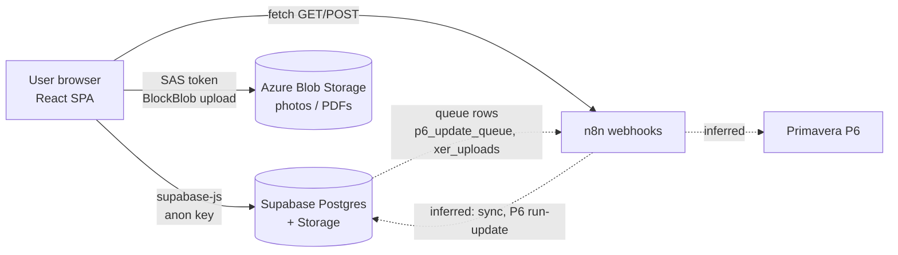
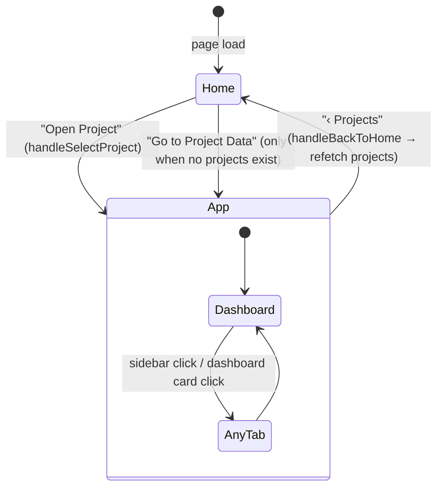
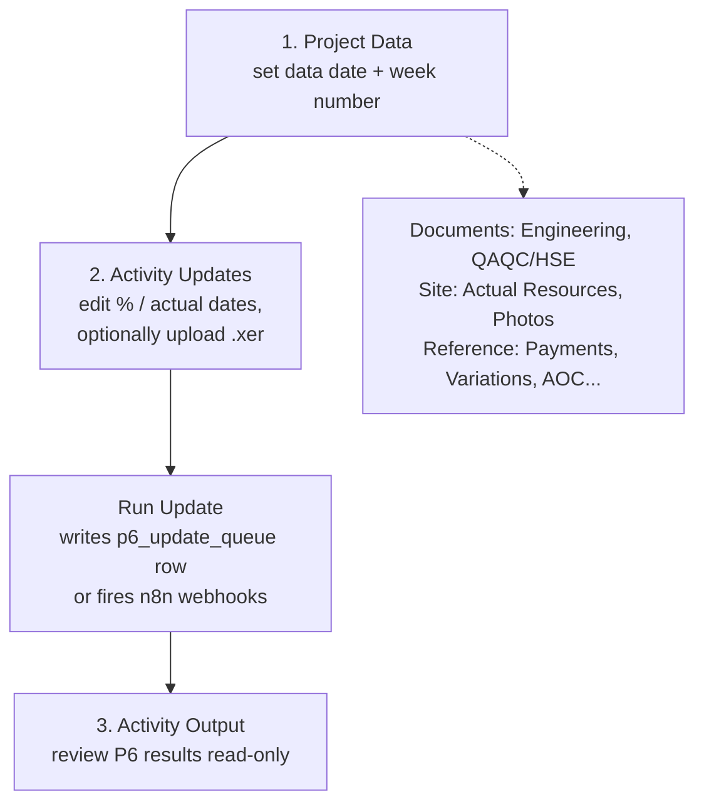
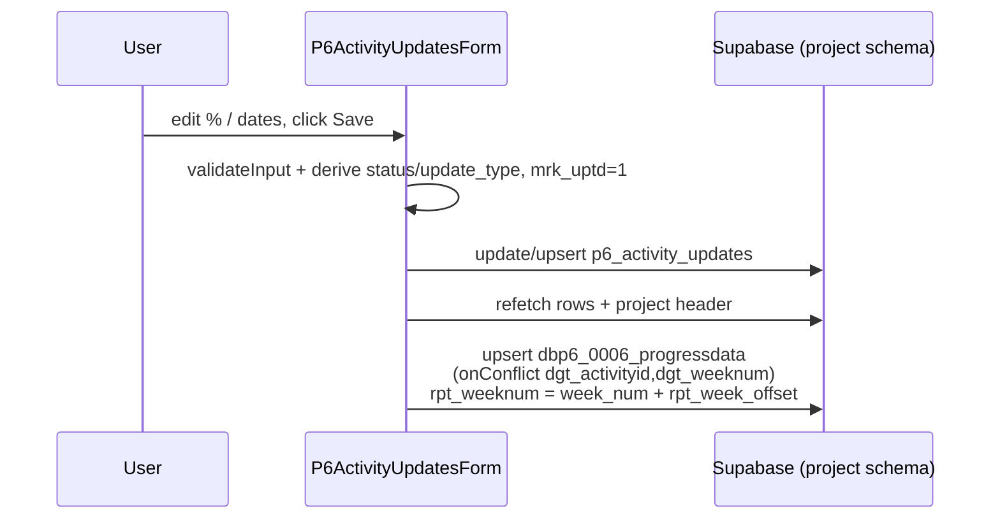

# P6 Project Controls Data Management — Technical Documentation

> Scope: this document describes the code in this repository as it exists on the
> `claude/kind-lamport-utwjgn` branch. Anything that happens **outside** this repo
> (Supabase tables/views/RLS, the n8n workflows, Azure containers, the P6 sync itself)
> is described only as far as the front-end code reveals it. Those places are marked
> *(inferred)* — verify them against the real systems before relying on them.

---

## 1. What this project is

A single-page web application used by project-controls staff to maintain the data that
feeds weekly Primavera P6 progress reporting for construction projects. It is a **thin
front-end over Supabase (PostgreSQL)** plus a handful of integrations:

| Concern | Technology |
|---|---|
| UI | React 18 + TypeScript, Tailwind CSS |
| Build / dev server | Vite 5 |
| Forms | `react-hook-form` (create modals), plain controlled inputs (inline edits) |
| Database / API / file storage | Supabase JS client (`@supabase/supabase-js`) |
| Photo & PDF storage | Azure Blob Storage (`@azure/storage-blob`, SAS-token auth from the browser) |
| Automation | n8n cloud webhooks (`pmc2p2c.app.n8n.cloud`) triggered via `fetch` |
| Hosting | Vercel (`vercel.json`: Vite build, SPA rewrite to `index.html`) |

There is **no backend of its own and no authentication layer in the code**. Every call
goes from the browser straight to Supabase / Azure / n8n.

---

## 2. Architecture



### 2.1 Multi-schema (multi-tenant) design

The most important architectural idea in the code: **each project can live in its own
Postgres schema.**

1. `public.p6_project_mapping` maps a project's text id (`dgt_projectid`) to a
   `schema_name`.
2. When a user opens a project, `App.handleSelectProject` looks that mapping up
   (`schema_name`, defaulting to `public`) and stores it in `selectedSchemaName`.
3. Every form receives `schemaName` as a prop and builds its client with
   `schemaClient(schemaName)` (`src/lib/supabase.ts`), which returns
   `supabase.schema(name)` — or the plain client when the schema is empty/`public`.

Consequences you need to know:

- Any non-`public` schema must be added to **Supabase → Settings → API → Extra schemas**
  or queries fail.
- The **project list itself** (home screen) and `p6_project_mapping` are always read from
  `public` using the default client.
- Some code is **hard-wired to a schema called `atgc`**: the stale-data badge query in
  `App.tsx`, project metadata in `ProjectDashboard.tsx`, and the photo/PDF forms
  (`atgc` unless the schema is `daikin`). See §9.

### 2.2 Source layout

```
src/
├── main.tsx                 React entry (StrictMode)
├── App.tsx                  Shell: project picker, sidebar, header, tab router, "Run Update"
├── lib/supabase.ts          Supabase client + schemaClient(schema)
├── types/database.ts        Row interfaces + a partial `Database` type (5 tables only)
├── hooks/useNotification.ts Toast state (success / error)
├── utils/csv.ts             exportToCsv(), parseCsvText(), parseCsvFile()
├── components/              Reusable UI (Modal, Pagination, SearchFilter, ColumnFilter,
│                            DateColumnFilter, FormField, ConfirmDialog, Notification,
│                            LoadingSpinner, CsvControls)
└── forms/                   One component per screen (see §5)
```

Path alias: `@/` → `src/` (configured in both `vite.config.ts` and `tsconfig.json`).

---

## 3. Application flow

### 3.1 Navigation state machine

`App.tsx` holds all navigation state in `useState` (no router; the URL never changes —
`vercel.json` only rewrites everything to `index.html`, so browser back/forward and deep
links don't work).



State kept in `App`:

| State | Purpose |
|---|---|
| `view` (`'home' \| 'app'`) | Project picker vs. workspace |
| `activeTab` (`TabKey`) | Which form `renderTabContent()` mounts (a `switch`) |
| `projectInfo[]` | Projects loaded from `dbp6_0000_projectdata` (public schema) |
| `selectedProjectId` | UUID `dgt_dbp6bd00projectdataid` |
| `selectedSchemaName` | Schema resolved from `p6_project_mapping` |
| `isDataStale`, `updatesCount` | Sidebar badges |
| `sidebarExpanded`, `collapsedSections` | Layout only |

Because `renderTabContent()` mounts one form at a time, **switching tabs unmounts the
previous form and discards its unsaved UI state** (filters, drafts, selected page).

### 3.2 Sidebar badges

`fetchSidebarBadges(projectId, schema)` (skipped for the `public` schema):

- **Stale** (amber dot on *Project Data*): `dgt_datadate` of the project is older than
  **8 days**.
- **Pending count** (blue pill on *Activity Updates*): count of rows in
  `p6_activity_updates` with `mrk_uptd = 1`.

### 3.3 The weekly workflow (what the UI is designed around)

The sidebar's first group, **WEEKLY WORKFLOW**, encodes the intended routine:



*(The ordering is the UI's intent. What the n8n workflows do on "Run Update" is not in
this repo.)*

### 3.4 Two different "Run Update" mechanisms — easy to confuse

| Where | What it does |
|---|---|
| **Header / Dashboard button** (`App.handleRunUpdate`) | Confirm dialog → fires **three n8n webhooks in parallel** with `project_id`, `schema`, and a timestamp (two `GET`, one `POST` — the same URLs as "Webhook 51/52 or 55/62" in Project Data). Uses `Promise.allSettled`, so it reports **"Update triggered successfully" even if every request failed**. |
| **Activity Updates tab → Run Update** (`P6ActivityUpdatesForm.handleRunUpdate`) | **Inserts a row** `{project_code, status:'pending'}` into `p6_update_queue` and returns its `execution_id`. A backend process *(inferred)* picks it up. The tab polls the last 5 queue rows every 10 s to show status. |

---

## 4. Data layer

### 4.1 Tables / views touched by the code

Naming convention: `dbp6_<nnnn>_<name>`; Dataverse-style column names (`dgt_*`).
Tables ending `_current` hold the live row per business key; `_history` keeps every
revision.

| Table / view | Used by | Notes |
|---|---|---|
| `dbp6_0000_projectdata` | App, ProjectData, Dashboard, most forms | Project master (name, parties, dates, `dgt_datadate`, `dgt_weeknum`, `rpt_week_offset`, `current_p6_project_code`) |
| `p6_project_mapping` | App, ProjectMapping | `dgt_projectid` ↔ `p6_project_code` ↔ `schema_name` (**`schema_name` is not in the `P6ProjectMapping` TS type** — it's read via a cast) |
| `dbp6_000401_engineering_current` / `_history` | Engineering | Upsert key `dgt_transmittalref`; history key `(dgt_transmittalref, dgt_revision)` |
| `dbp6_000402_qaqc_hse_current` / `_history` | QAQC/HSE | Upsert key `dgt_docref`; history key `(dgt_docref, dgt_revision)` |
| `dbp6_000501_actualresources_current` | Actual Resources | Filtered by `week_num` |
| `dbp6_0006_progressdata` (write) / `progress_latest_week` (read view) | Activity Updates / Progress Data | Upsert key `(dgt_activityid, dgt_weeknum)` |
| `p6_activity_updates` | Activity Updates | Upsert key `(project_code, task_code)`; `mrk_uptd=1` = "pending push to P6" |
| `p6_activity_output_flat` | Activity Output | Read-only P6 results |
| `p6_update_queue` | Activity Updates, Dashboard | Run-update requests + status |
| `xer_uploads` + Storage bucket `xer-uploads` | Activity Updates | XER file registry |
| `dbp6_areas_of_concern`, `dbp6_0009_payments`, `dbp6_0010_variations` | AOC / Payments / Variations | Payments upsert key `ref`; variations key `dgt_voref` |
| `dbp6_0018_discipline`, `dbp6_0019_type`, `dbp6_activity_discipline`, `dbp6_activity_work_type`, `dbp6_0015_trades`, `dbp6_0016_subtrades` | Reference Data (+ lookups) | Lookup tables |
| `p6forms_photoupload`, `pdf_form_uploads` | Photos / PDF Upload | Metadata for Azure blobs |
| `p6_inspection_reports` (+ bucket `inspection-reports`) | Dashboard card, `InspectionReportForm` | See §9 — form isn't reachable |

### 4.2 Typing

`src/types/database.ts` has row interfaces for most tables, but the `Database` generic
passed to `createClient` declares only **5** tables, and none of the `_current` tables or
views. That's why the code is full of `as never` / `as any` casts. Compile-time safety on
queries is therefore **minimal**; a renamed column fails at runtime, not at `tsc`.

### 4.3 Environment variables (Vite, exposed to the browser)

| Variable | Used for |
|---|---|
| `VITE_SUPABASE_URL`, `VITE_SUPABASE_ANON_KEY` | Supabase client (falls back to placeholder strings if missing — no error is raised) |
| `VITE_AZURE_STORAGE_ACCOUNT`, `VITE_AZURE_SAS_TOKEN`, `VITE_AZURE_CONTAINER` | Photo uploads |
| `VITE_PDF_AZURE_STORAGE_ACCOUNT`, `VITE_PDF_AZURE_SAS_TOKEN`, `VITE_PDF_AZURE_CONTAINER` | PDF uploads |

`README.md` tells you to `cp .env.example .env`, but **no `.env.example` exists in the
repo**, and the Azure variables aren't documented there.

---

## 5. Screens (forms) — code and behaviour

### 5.1 Common patterns

Almost every screen follows the same recipe, so learn it once:

- **Props:** `projectId` (UUID), `projectTextId` (text id), `schemaName`; each form picks
  the ones it needs.
- **Load:** `useEffect` → Supabase `select`, usually server-side paginated
  (`.range()`, `count: 'exact'`, **15 rows/page**), with 300 ms debounced search
  (`.or(... ilike ...)`) and per-column filters.
- **Inline edit:** click the pencil → row cells turn into inputs (amber border) → Save
  opens a confirm dialog → `update` → refetch. Some tabs (Project Data) edit a single
  cell on Enter/Escape instead.
- **Create:** a `Modal` with `react-hook-form`; closing a dirty form asks "discard?".
- **Delete:** always behind `ConfirmDialog`.
- **Feedback:** `useNotification()` → `<Notification>` toast.
- **CSV:** export (`utils/csv.exportToCsv`) and import (`CsvControls` →
  `parseCsvFile`) on most data tabs.

Shared components (`src/components/`):

| Component | Role |
|---|---|
| `Modal` | Overlay; Esc closes; locks body scroll |
| `ConfirmDialog` | Destructive/save confirmations |
| `Pagination` | Page buttons with ellipsis, "Showing x–y of N" |
| `SearchFilter` | Search box |
| `ColumnFilter` / `DateColumnFilter` | Excel-style distinct-value filter; date filter groups by month-year; both support a `BLANK` option |
| `FormField` | Label + error wrapper for react-hook-form |
| `Notification`, `LoadingSpinner`, `CsvControls` | As named |

### 5.2 Screen reference

| Tab (sidebar label) | Component | What the user does | Notable logic |
|---|---|---|---|
| **Dashboard** | `ProjectDashboard` | Sees project header, six summary cards (Engineering, QAQC, Resources, Progress, Activities, Inspections), data-staleness warning, last 5 update-queue runs. Cards click through to the tab. | Counts via `select('*',{count:'exact',head:true})` in `Promise.allSettled`; "pending" = `mod_id = 1` (docs) or `mrk_uptd = 1` (activities); queue polled every 10 s; stale = data date > 8 days. |
| **Project Data** | `ProjectDataForm` | View/edit the project master record, create new projects, run the sync webhooks (51/52/53/55/62) from a modal. | `dgt_datadate` is stored shifted: `encodeDataDate` saves `date − 1 day @ 23:00Z`, `decodeDataDate` reverses it (a timezone workaround — keep both functions in sync if you touch either). Webhook 52 and 53 point at the **same URL**. |
| **Activity Updates** | `P6ActivityUpdatesForm` | Edit % complete / actual start / actual finish per activity (single-row or *Edit All* on the page), import/export CSV, upload an `.xer`, trigger a P6 run. | See §5.3. |
| **Activity Output** | `P6ActivityOutputForm` | Read-only browse of P6 results with status / WBS / type filters and sorting. | Reads `p6_activity_output_flat`. |
| **Engineering** | `EngineeringForm` | Maintain transmittals; filter by any column; legends for discipline/type codes; CSV import/export; "Post Update" webhook. | Import: keep highest revision per `dgt_transmittalref`, upsert to `_current`, then upsert to `_history`; sets `mod_id = 1` (= "modified/pending"). Export pages 1000 rows at a time. |
| **QAQC / HSE** | `QaqcHseForm` | Same pattern for QAQC/HSE documents. | Upsert key `dgt_docref`; editable `dgt_status` and `mod_id`; week filter. |
| **PDF Upload** | `PdfUploadForm` | Choose type **LA** or **DA**, pick a PDF, confirm/override week number and data date, upload. | Blob name `<projectTextId>/<LA\|DA>_<week>.pdf`; same name re-uploaded **overwrites** the blob; Supabase insert failure triggers best-effort blob delete. |
| **Actual Resources** | `ActualResourcesForm` | Weekly head-count per resource; week selector (defaults to latest); CSV import/export; "Post Update" webhook. | Looks up the schema-local project UUID by `dgt_projectid` before querying. Contains leftover debug `console.log`s including an unfiltered sample query. |
| **Photos** | `PhotoUploadForm` | Drag-and-drop images, pick a date, upload; gallery with lightbox and delete. | Blob `<folder>/<date>-<serial>.<ext>` where folder = projectId (or `daikin`); serial comes from a per-session `useRef` counter starting at 1 (see §9). Metadata row written after the blob; row failure deletes the blob. |
| **Progress Data** | `DynamicActualDataForm` | Read-only view of `progress_latest_week` with activity-id and week filters (explicit *Apply*). | Server-side pagination, race guarded with a `cancelled` flag. |
| **Project Mapping** | `P6ProjectMappingForm` | CRUD `dgt_projectid ↔ p6_project_code`. | Global table (not project-scoped). |
| **Areas of Concern** | `AreasOfConcernForm` | Log and track AOCs, change status, CSV import. | Table `dbp6_areas_of_concern`. |
| **Variations** | `VariationsForm` | CRUD variation orders; CSV import upserts on `dgt_voref`. | Scoped by `dgt_projectid` text. |
| **Payments** | `PaymentsForm` | CRUD IPA/IPC payments; CSV import upserts on `ref`. | Scoped by project UUID. |
| **Reference Data** | `ReferenceDataForm` (+ `TradesForm`, `SubtradesForm`) | Maintain Disciplines, Types, Activity Disciplines, Activity Work Types, Trades, Subtrades as cards. | Config-driven via `REF_TABLES`. Editing a row whose primary key is the code (activity tables) is implemented as delete + insert (not atomic). |

### 5.3 Deep dive: Activity Updates (the core screen)

State derived on every edit (`deriveFields`, `resolveStatusCode`):

```
status_code:  100% OR (start && finish) → "Completed"
              >0%  OR (start && !finish) → "In Progress"
              otherwise                  → "Not Started"
update_type:  pct == 0        → "reset"
              pct < original  → "deprogress"
              otherwise       → "progress"
mrk_uptd:     set to 1 whenever start/finish/%/status/update_type is edited
```

Validation (`validateInput`): finish may not precede start; % may not exceed 100.

Save path (`handleSaveEdit` / `handleSaveAll`):



Note the progress-data sync is a **second, separate write** that happens after the first
succeeds; if it fails the user sees a toast but the activity row is already saved
(no transaction).

CSV import: parse → dedupe by `project_code|task_code` (last wins) → force
`project_code = projectTextId` → count updates vs inserts → upsert on
`(project_code, task_code)` → for rows with `mrk_uptd = 1`, also upsert progress data.

XER upload: file stored in bucket `xer-uploads` at
`<projectTextId>/<p6Code>_Week<week>_<dataDate>.xer` (`upsert: true`), then a row is
inserted into `xer_uploads` with `onedrive_status: 'pending'` *(a downstream job
presumably copies it to OneDrive — inferred from the column name)*.

---

## 6. How a user interacts with the app (walkthrough)

1. **Open the app.** The home screen lists every project (name, contractor, location,
   date range, project id). If there are none, a button jumps straight to Project Data to
   create one.
2. **Click "Open Project".** The app resolves the project's schema and lands on the
   **Dashboard**: summary cards, data-date freshness, recent update-queue runs.
3. **Weekly routine** (sidebar → *Weekly Workflow*):
   1. *Project Data* — update the **Data Date** and **Week No.** (amber dot = data date is
      > 8 days old). Use **Sync / Update Webhooks** if a refresh is needed.
   2. *Activity Updates* — find activities (search / column filters / sort), edit
      % complete and actual dates (pencil for one row, **Edit All** for the page), Save.
      Optionally upload the latest `.xer`. Click **Run Update** and watch the queue
      status.
   3. *Activity Output* — review the P6 results.
4. **Maintain supporting data** as needed: Engineering/QAQC documents, Actual Resources
   per week, Photos, PDFs (LA/DA), Payments, Variations, Areas of Concern.
5. **Bulk work:** every data tab can export to CSV; most can import a CSV (columns must
   match the exported headers; rows without the key column are dropped).
6. **Go back** with "‹ Projects" at the top-left to switch project.

Conventions the user will see everywhere: amber-bordered inputs = row is being edited;
green/red toast = result; "BLANK" in a column filter = null values; sidebar can be
collapsed to icons.

---

## 7. Build, run, deploy

```bash
npm install
# create .env with VITE_SUPABASE_URL / VITE_SUPABASE_ANON_KEY (+ Azure vars for uploads)
npm run dev        # http://localhost:5173
npm run build      # tsc && vite build  → dist/
npm run preview
npm run lint       # eslint (note: no ESLint config file is committed — see §9)
```

Deploy: Vercel with `buildCommand: npm run build`, `outputDirectory: dist`; set the
`VITE_*` variables in the Vercel dashboard. There are **no automated tests** in the repo.

Supabase prerequisites: tables/views listed in §4, storage bucket `xer-uploads`, extra
exposed schemas for every project schema, and RLS policies appropriate for whatever
access model you choose (see §8).

---

## 8. Security considerations (read before exposing this publicly)

These follow directly from the code; they are not hypothetical.

1. **No authentication in the app.** Whoever can load the site can read/write using the
   anon key. Security rests **entirely** on Supabase RLS. The README's suggested policy
   (`USING (true) WITH CHECK (true)`) makes every table world-writable to anyone holding
   the key — acceptable only as a throwaway dev setting.
2. **Azure SAS tokens are bundled into the JS** (`VITE_*_SAS_TOKEN`). Anyone can extract
   them from the browser and use them for as long as they're valid, with whatever
   permissions they carry (the code needs create/write **and delete**).
3. **n8n webhook URLs are hard-coded** in `App.tsx`, `ProjectDataForm.tsx`, and four
   other forms and are unauthenticated GET/POST endpoints. Anyone who reads the bundle can
   trigger them with any `project_id`/`schema`.
4. **Client-supplied schema name** goes to `supabase.schema(name)`; PostgREST only allows
   the exposed schemas, which is your only guard.
5. Search terms are interpolated into PostgREST `.or()` filter strings
   (`ilike.%${term}%`) without escaping commas/parentheses; this can break or alter the
   filter expression (not SQL injection, but a correctness/abuse vector).

---

## 9. Known issues, inconsistencies, and tech debt

Ordered roughly by how likely they are to bite you.

| # | Issue | Where |
|---|---|---|
| 1 | **Global "Run Update" reports success unconditionally** (`allSettled`, results ignored; `fetch` doesn't reject on HTTP errors anyway). Same for the per-form webhook buttons: `await fetch` without checking `response.ok`, so a 4xx/5xx shows green. | `App.tsx`, `EngineeringForm`, `QaqcHseForm`, `ActualResourcesForm`, `ProjectDataForm` |
| 2 | **Hard-coded `atgc` schema** in the stale badge, dashboard meta/inspection count, photos, PDFs. Projects in any other schema (except `daikin` for photos/PDFs) will show wrong/empty data. | `App.tsx:244`, `ProjectDashboard.tsx`, `PhotoUploadForm`, `PdfUploadForm` |
| 3 | **Photo serial numbers** reset to 1 each page load (`useRef(1)`), so same-day uploads in a later session produce the same blob name `<date>-1.ext` and **overwrite** earlier photos in Azure (the upload uses no "if-none-match" guard) while adding a second DB row pointing to the same blob. | `PhotoUploadForm.tsx` |
| 4 | **Non-atomic multi-step writes** (activity save → progress sync; Engineering/QAQC import → current then history; Reference Data delete+insert; Azure blob + DB row). Partial failure leaves inconsistent data. | several |
| 5 | **`InspectionReportForm` is dead code** — not imported anywhere, so users can't reach it, yet the Dashboard shows an "Inspections" card and clicking it calls `onNavigate('inspectionreports')`, which matches no `case` in `renderTabContent`, so the user gets a blank page. Likewise `ActivityDisciplineForm`, `ActivityWorkTypeForm`, `DisciplineForm`, `TypeForm` are not imported (Reference Data re-implements them via `REF_TABLES`). | `src/forms/` |
| 6 | **README is stale**: describes 4 forms and 4 tables; actual app has 15 screens and different table names (`_current`/`_history`). Setup refers to a missing `.env.example`. | `README.md` |
| 7 | **Typing is mostly bypassed** (`as never`, `as any`, 5-table `Database` type, `schema_name` missing from `P6ProjectMapping`). | `types/database.ts`, all forms |
| 8 | **Debug logging left in production code**, including full Supabase client objects and an unfiltered 5-row sample query of the resources table. | `P6ActivityUpdatesForm`, `ActualResourcesForm`, `EngineeringForm` |
| 9 | `npm run lint` can't pass as committed: no `.eslintrc*` in the repo (and some files use `eslint-disable` comments for it). | repo root |
| 10 | Ten `tmpclaude-*-cwd` scratch files and `.claude/settings.local.json` are **committed**. | repo root |
| 11 | Duplicated code: CSV helpers exist in `utils/csv.ts` **and** re-implemented inside `P6ActivityUpdatesForm`; the month-range date filter block is copy-pasted four times in `EngineeringForm`; the "single-row edit" pattern is re-implemented per form. Several forms are 700–1,200 lines. | various |
| 12 | `activeTab` initial value is `'engineering'` but is immediately overridden to `'dashboard'` on project open; harmless but misleading. Webhook 52 and 53 share one URL. | `App.tsx`, `ProjectDataForm` |
| 13 | Unit/integration tests: none. | — |

### Suggested priorities

1. Decide the auth/RLS model and move SAS-token and webhook calls behind a small server
   (Vercel function / Supabase Edge Function) — this fixes §8.2–8.3 and issue 1 together
   (the server can check `response.ok` and return a real status).
2. Remove the `atgc` hard-coding (issue 2) by always using `selectedSchemaName`.
3. Generate types from Supabase (`supabase gen types typescript`) and drop the casts.
4. Fix photo naming (use a UUID or timestamp) before more photos are overwritten.
5. Delete dead forms or wire them in; refresh the README from this document.

---

## 10. Glossary

| Term | Meaning |
|---|---|
| **P6** | Oracle Primavera P6 scheduling software |
| **XER** | P6's export/import file format |
| **Data date** | The "as of" date of a weekly progress update (`dgt_datadate`) |
| **`mod_id = 1` / `mrk_uptd = 1`** | Row modified in this app and not yet processed downstream *(inferred from how the dashboard labels them as "pending")* |
| **`_current` / `_history`** | Latest row per business key vs. every revision |
| **LA / DA** | The two PDF categories in PDF Upload; the code doesn't define the acronyms — confirm the expansion with the business |
| **IPA / IPC** | Interim payment application / certificate (standard construction terms) |
| **AOC** | Area of Concern |
| **rpt_weeknum** | Reporting week = `dgt_weeknum + rpt_week_offset` |
